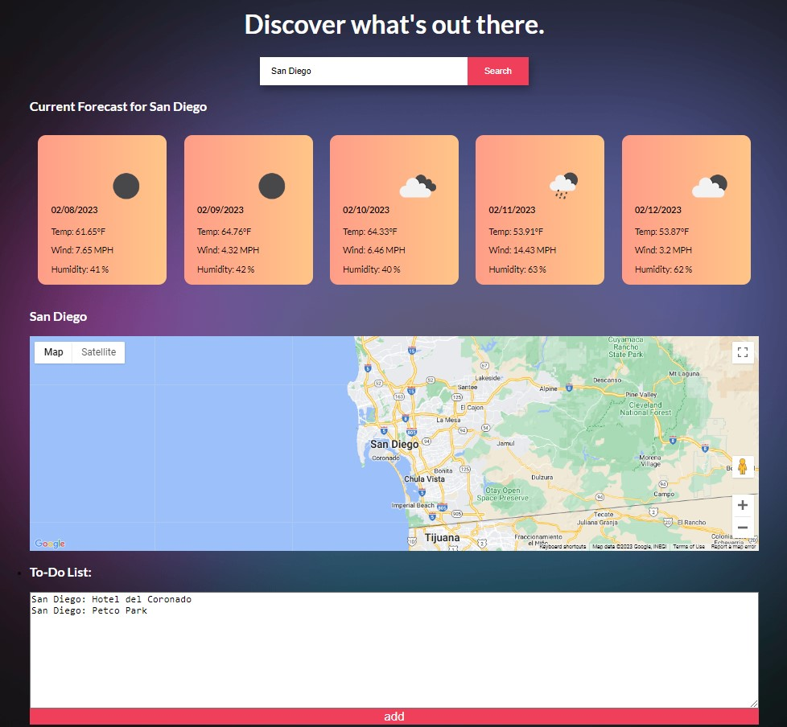

# Sherpa

```
Sherpa is a travel guide which displays information about the weather and local landmarks. Upon entering your location, this web application displays the current weather conditions, a forecast for the next four days, and provides a place to save notes about your vacation to local storage.
```

## Why we made it

```
We were motivated to develop Sherpa by the desire to optimize our vacation time and streamline the planning process. We wanted to view the most relevant information in order to more easily make decisions about what to do on vacation.
```

## User Story

```
AS a traveler,
I WANT to see the local weather forecast and write notes about activities to do
SO THAT I can optimize my vacation time.
```
## Acceptance Criteria

```
GIVEN I am a traveler
WHEN I input my destination
THEN I am presented with that location's current and 5 day weather forecast
WHEN I redirect to sherpa.html
THEN a map/list loads pins and a corresponding list of local landmarks
WHEN I click on the activity in the list
THEN the map moves to the corresponding pin
WHEN I add an landmark to my to-do list
THEN I see the landmark again when I revisit.
```

## Screenshot



## Deployed URL

https://patrickmc19.github.io/sherpa/

## Usage

```
Type in the name of the city of interest and hit enter!
```

## Sources

```
Sass
TailwindCSS
JQuery
Google Places API
OpenWeatherMap API
```

## Credits

```
Ruben Franco (github: RubenFr74)
Patrick McKnight (github: patrickmc19)
Sophia Ruiz (github: sophiaaruiz)
Mikaila Valentine (github: mikailavalentine)
```
